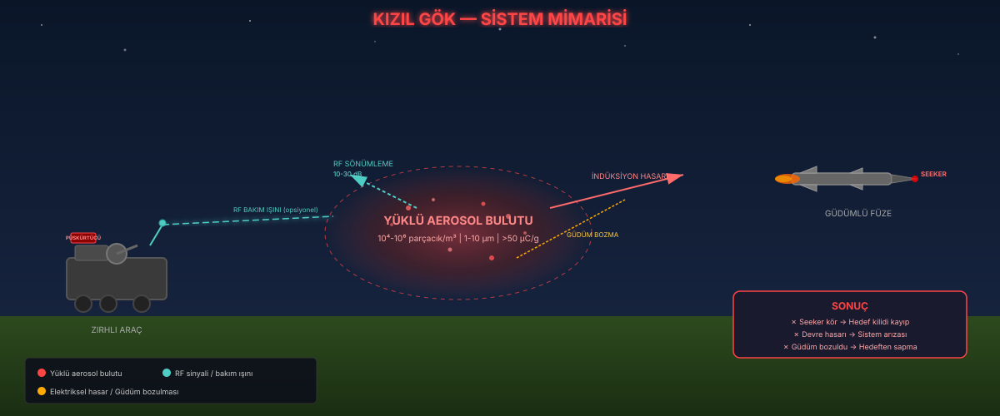

# KIZIL GÖK 🔴sky

**Aktif yumuşak öldürme (soft-kill) koruma sistemi** — yüklü aerosol bulutları ile güdümlü füzeleri kör eder.

## Sistem Mimarisi



## Demo


## Temel Prensip

Füze vurulmaz; **görmez, şaşar veya arayıcisi yanar.**

- **RF Körlüğü**: İletken aerosol bulutu X-band radar sinyalini 10-30 dB zayıflatır
- **Elektriksel Hasar**: Yüklü buluttan geçen füze gövdesinde dΦ/dt indüksiyonu
- **Güdüme Müdahale**: Bulutun EM ortamı PN güdüm algoritmasını bozar

## Konsept

İki serpici (İHA + kule), gelen füzenin son yaklaşım koridorunu kuşatır ve yüklü iletken aerosol bulutu serper. Bulut:

1. **RF sinyali zayıflatır** → seeker data-link'i ve radar dönüşü körelir
2. **Yanılsama yaratır** → körleşen seeker yanlış noktaya kilitlenir, güdüm sistematik sapar
3. **Induksiyon akımı bindirir** → yoğun buluttan geçen arayıcı devresi yanabilir (seeker burnout)

## Fizik Modeli

| Bileşen | Model |
|---|---|
| Parçacık dinamiği | Coulomb itişimi (yumuşatılmış) + hava sürüklenmesi + etkili yerçekimi |
| Yük bozunumu | Korona boşalması, üstel azalma (`tau = 25 s`) |
| Füze güdümü | Orantılı seyrükleme (PN, `N = 4`), kilitle azalan otorite |
| Seeker bozulumu | Yerel yüklü yoğunluk → RF zayıflaması → kilit kaybı + yanilsama kayması (bias random walk) |
| Seeker yanması | Yoğunluk eşiği üstünde olasılıksal induksiyon yanması |
| **Fünye (yeni)** | S&A devre bozulması olasılığı (S(rawValue)_SAFE_P_BURNOUT = 0.85) |

## Senaryo Sonuçları

Aynı parametrelerle farklı tohumlar gerçekçi dağılım verir:

- `SAPTI — bulut füzeyi kör etti` → kilit kaybı + yanılsama füzyonu saptırdı
- `ÇAKILDI — SAVAŞ BAŞLIĞI ETKİSİZ (dud)` → induksiyon akımı seeker'ı ve fünye S&A devresini birlikte yaktı; füze patlamadan çakıldı
- `VURDU — bulut yetersiz` → yoğunluk/ zamanlama yetmedi (tesisat parametresi)

## Çalıştırma

```bash
pip install -r requirements.txt

# Headless simülasyon
python3 run_sim.py 42

# Sinematik video üretimi (gece sahnesi, HUD, slow-motion angajman)
python3 render_cinematic.py 99 media/demo_sinematik.mp4

# Hız deneyi
python3 exp_speed.py

# Eski stil bilimsel animasyon
python3 animate.py 99 media/demo.mp4
```

Python 3.11+, numpy, matplotlib, pillow, ffmpeg gerektirir.

## Hız Deneyi

"Yüksek hızlı füze buluttan fazla hızlı geçemez mi?" sorusunun sim cevabı — varış anı sabit, yalnızca geçiş hızı değişir (5 tohum):

| Hız | Taban duvar | Yoğun duvar (2x parçacık, K↓, q↑) |
|---|---|---|
| 300 m/s | %40 | **%100** |
| 600 m/s | %0 | **%100** |
| 1200 m/s | %0 | **%40** |

Bulgular:
- Etki süresi = duvar derinliği ÷ füze hızı, ama RF körlüğü anlıktır (EM alan ışık hızında işler) ve induksiyon EMF'si geçiş hızıyla ARTAR
- Kritik keşif: parçacık sayısını tek başına artırmak Coulomb şişmesiyle duvarı SEYRELTIYOR; yoğunluk = parçacık × yük ÷ itişim dengesiyle yönetilmeli
- Süpersonik hedefler için yol haritası: yoğun + katmanlı duvar kombinezonu ve RF bakım ışını

## Görünürlük Notu

Gerçek sistemde duvar **gözle görünmez**dir: 1-5 mikron iletken mikro-küreler Rayleigh rejiminde saçılır (optik olarak şeffaf), oda sıcaklığında IR imzası yoktur, λ/10 altı boyut sayesinde düşman radarında parlak blob oluşturmaz. Simülasyon görsellerindeki ışıltı yalnızca izleyiciye anlatım amaçlıdır.

## Dokümanlar

- [Aşama 1 Laboratuvar Protokolü](docs/ASAMA1_PROTOKOL.md) — Ekipman listesi, deney tasarımı, bütçe (~₺356k)
- [Patent Disclosure](docs/PATENT_DISCLOSURE.md) — Buluş bildirim formu (TÜRPATENT'e teslim için)
- [TÜBİTAK 1512 BiGG Başvurusu](docs/TUBITAK_1512_BASVURU.md) — İş planı taslağı

## Proje Yapısı

```
kizil-gok/
├── sim/                    # Simülasyon çekirdeği
│   ├── config.py           # Fizik parametreleri (aerosol + arayıcı + fünye)
│   ├── particles.py        # Parçacık bulutu + Coulomb dinamiği + yoğunluk
│   ├── missile.py          # PN güdümlü füze + arayıcı + bias
│   ├── effects.py          # RF sönümleme + arayıcı yanması + fünye etkisizleştirme
│   └── engine.py           # Simülasyon döngüsü + Result
├── render_cinematic.py     # PIL sinematik video (gece sahnesi, HUD, slow-mo)
├── animate.py              # Matplotlib animasyon
├── run_sim.py              # Headless çalıştırıcı
├── exp_speed.py            # Hız deneyi (çoklu config)
├── docs/                   # Dokümanlar
│   ├── ASAMA1_PROTOKOL.md  # Laboratuvar test planı
│   ├── PATENT_DISCLOSURE.md # Patent bildirimi
│   └── TUBITAK_1512_BASVURU.md # TÜBİTAK başvuru taslağı
├── media/                  # Video, poster, GIF
└── requirements.txt        # Python bağımlılıkları
```

## Yol Haritası

- [x] 2B parçacık + bulut dinamiği + 2 serpici
- [x] PN güdümlü füze + seek lock
- [x] Arayıcı tükeme布尔 (burnout) + S&A fünye modeli
- [x] Bulut doldurma bonusu
- [x] Hız deneyi — yoğun duvar 600 m/s'de %100
- [x] Sinematik video + GIF
- [x] Laboratuvar protokolü + patent disclosure + TÜBİTAK taslağı
- [ ] Aşama 1 laboratuvar testleri (Ekim 2026)
- [ ] 3B genişletme + rüzgar alanı
- [ ] Monte Carlo istatistiksel grafik
- [ ] RF bakım ışını deneyi

## Güvenlik Notu

Bu proje savunma Ar-Ge kapsamındadır. Tüm testler kapalı alanda, sivil hayata etki olmayacak şekilde tasarlanmıştır. Fiziksel silah içermemektedir.
