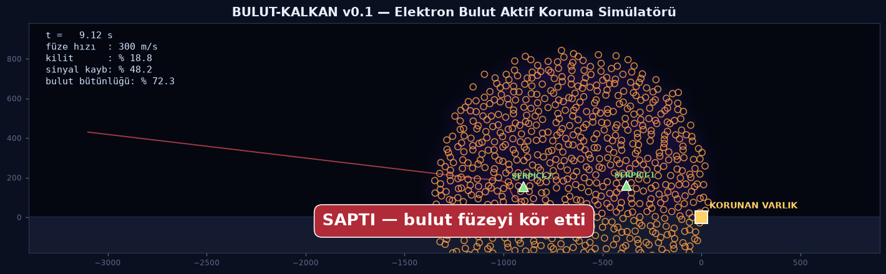

# BULUT-KALKAN ⚡🛡️

**Elektron Bulut Aktif Koruma Sistemi — Konsept Simülatörü**

Gelen füzeye karşı korunan varlığın önüne **yüklü parçacık bulutu (elektron duvar)** serpen yumuşak öldürme (soft-kill) sistemi konseptinin fizik simülasyonu ve animasyonu.

Füze vurulmaz; **görmez, şaşar veya arayıcisi yanar.**



## Konsept

İki serpici (İHA + kule), gelen füzenin son yaklaşım koridorunu kuşatır ve yüklü iletken aerosol bulutu serper. Bulut:

1. **RF sinyali zayıflatır** → seeker data-link'i ve radar dönüşü körelir
2. **Yanılsama yaratır** → körleşen seeker yanlış noktaya kilitlenir, güdüm sistematik sapar
3. **Induksiyon akımı bindirir** → yoğun buluttan geçen arayıcı devresi yanabilir (seeker burnout)

## Fizik Modeli

| Bileşen | Model |
|---|---|
| Parçacık dinamiği | Coulomb itişimi (yumuşatılmış) + hava sürüklenmesi + etkili yerçekimi |
| Yük bozunumu | Korona boşalması, üstel azalma (`tau = 25 s`) |
| Füze güdümü | Orantılı seyrükleme (PN, `N = 4`), kilitle azalan otorite |
| Seeker bozulumu | Yerel yüklü yoğunluk → RF zayıflaması → kilit kaybı + yanilsama kayması (bias random walk) |
| Seeker yanması | Yoğunluk eşiği üstünde olasılıksal induksiyon yanması |

## Çalıştırma

```bash
pip install -r requirements.txt

# headless simülasyon (farklı tohumlar farklı senaryolar üretir)
python3 run_sim.py 42

# animasyonlu video + poster
python3 animate.py 99 media/demo.mp4
```

Python 3.11+, numpy, matplotlib, ffmpeg gerektirir.

## Senaryo Sonuçları

Aynı parametrelerle farklı tohumlar gerçekçi dağılım verir:

- `SAPTI — bulut füzeyi kör etti` → kilit kaybı + yanılsama füzyonu saptırdı
- `SEEKER YANDI` → induksiyon akımı arayıcıyı yaktı, füze balistik uçtu
- `VURDU — bulut yetersiz` → yoğunluk/ zamanlama yetmedi (tesisat parametresi)

Parametreler `sim/config.py` içinde; duvar yoğunluğu, yük karışımı (+/-), serpici yerleşimi ve seeker eşikleri oynanabilir.

## Yol Haritası

- [ ] 3B genişletme + rüzgar alanı
- [ ] Aynı işaretli / karışık yük (+/-) karşılaştırmalı deneyler
- [ ] Çoklu füze salvosu ve maliyet-değişim optimizasyonu
- [ ] Monte Carlo toplu koşucu (isabet istatistikleri grafiği)
- [ ] Serpici balistiğinin gerçek roket modeliyle değiştirilmesi

## Not

Bu depo **konsept düzeyinde eğitim ve Ar-Ge simülasyonudur**; gerçek bir silah tasarımı içermez.
