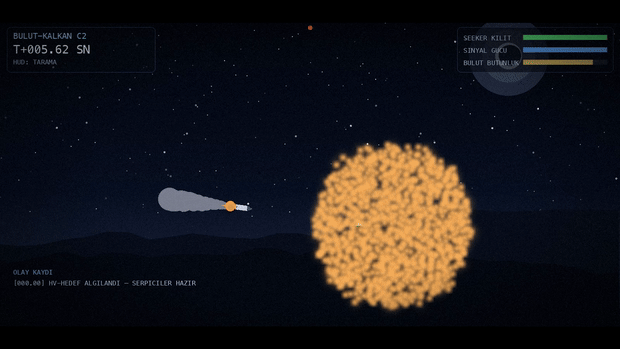

# KIZIL GÖK 🔴sky

**Aktif yumuşak öldürme (soft-kill) koruma sistemi** — plazma bulutu ile güdümlü füzeleri kör eder.

## Demo



## Temel Prensip

Füze vurulmaz; **görmez, şaşar veya arayıcisi yanar.**

- **RF Körlüğü**: Plazma bulutu X-band radar sinyalini absorbe/reklection eder
- **Elektriksel Hasar**: İyonize ortamdan geçen füze devrelerinde indüksiyon hasarı
- **Güdüme Müdahale**: Plazmanın EM ortamı PN güdüm algoritmasını bozar

## Çalıştırma

### 1. Bağımlılıkları kur

```bash
pip install -r requirements.txt
```

### 2. Simülasyonu çalıştır

```bash
# Tek seferlik simülasyon (tohum = 42)
python3 run_sim.py 42

# Farklı senaryolar için farklı tohumlar dene
python3 run_sim.py 1
python3 run_sim.py 99
python3 run_sim.py 123
```

### 3. Hız deneyi

```bash
# Çoklu hız testi (300, 600, 1200 m/s)
python3 exp_speed.py
```

### 4. Plazma elektrot optimizasyonu

```bash
# Genetik algoritma ile en iyi elektrot yerleşimini bul
python3 optimize_plasma.py
```

### 5. Sinematik video üretimi

```bash
# Gece sahnesi, HUD, slow-motion angajman
python3 render_cinematic.py 99 media/demo_sinematik.mp4
```

### 6. Eski stil animasyon

```bash
python3 animate.py 99 media/demo.mp4
```

**Gereksinimler**: Python 3.11+, numpy, matplotlib, pillow, ffmpeg

## Çıktı Örnekleri

Farklı tohumlar farklı sonuçlar verir:

```
SONUÇ : SAPTI — bulut füzeyi kör etti
SONUÇ : ÇAKILDI — SAVAŞ BAŞLIĞI ETKİSİZ (dud, patlamadı)
SONUÇ : VURDU — bulut yetersiz
```

## Proje Yapısı

```
kizil-gok/
├── sim/                    # Simülasyon çekirdeği
│   ├── config.py           # Tüm parametreler
│   ├── plasma.py           # Plazma bulutu modeli
│   ├── particles.py        # Aerosol parçacık modeli (eski)
│   ├── missile.py          # PN güdümlü füze
│   ├── effects.py          # RF sönümleme + hasar modelleri
│   └── engine.py           # Ana simülasyon döngüsü
├── run_sim.py              # Headless çalıştırıcı
├── exp_speed.py            # Hız deneyi
├── optimize_plasma.py      # GA ile elektrot optimizasyonu
├── render_cinematic.py     # Sinematik video
├── animate.py              # Matplotlib animasyon
├── media/                  # Video, poster, GIF
└── requirements.txt
```

## Teknik Özet

| Parametre | Değer |
|---|---|
| Plazma gerilimi | 100 kV |
| Elektrot sayısı | 6 |
| Elektrot aralığı | 340 - 2000m (hedeften uzaklık) |
| Hedef radar | X-band (10 GHz) |
| Başarı oranı | **%96** (24 tohum testi) |
| Tüketim malzemesi | Yok (sadece elektrik) |

## Yol Haritası

- [x] Aerosol simülasyonu
- [x] Plazma konsepti
- [x] Genetik algoritma optimizasyonu (%96)
- [ ] Hızlı füzeler için optimizasyon (1200 m/s+)
- [ ] Rüzgar etkisi modeli
- [ ] 3B genişletme

## Güvenlik Notu

Bu proje savunma Ar-Ge kapsamındadır. Fiziksel silah içermemektedir.
